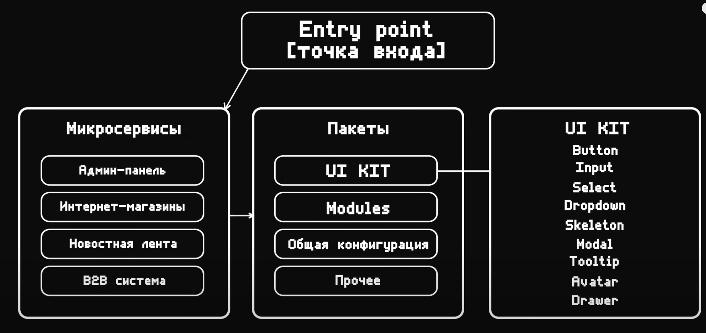
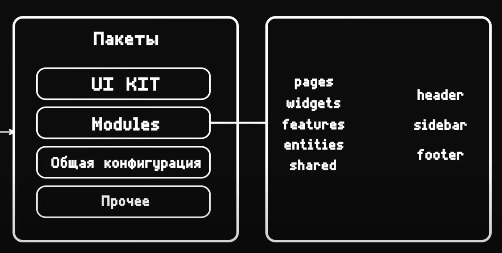
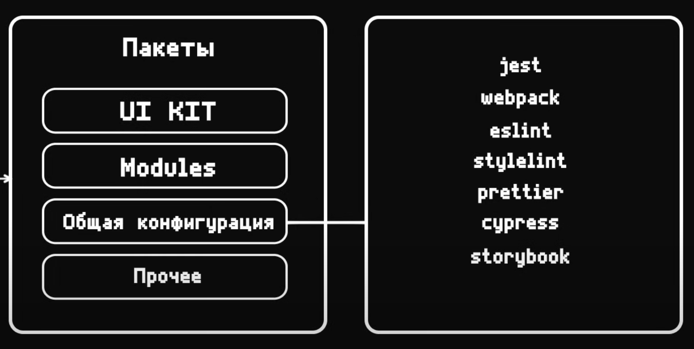

# Webpack module federations
In this project we will use "npm workspace" to manage the monorepository.
And we will use "Webpack module federations" to manage micro services (micro frontends)

## Monorepository overview





`/services` folder keeps applications, `/packages` contain reusable code

We will keep a naming convention for our repositories starting with `@packages/`, e.g. build-config app will have `@packages/build-config` name

To use packages in our services we need to include them to dependecies of package.json in our services.
Check: `/services/host/package.json`
```json
"dependencies": {
    "@packages/shared": "*", // start means any version is ok to use
    "@packages/build-config": "*"
}
```

Bootstrap file is created inside host repo, it is used as an entry point, index file in host repo lazily imports bootstrap file

`new webpack.container.ModuleFederationPlugin` is used inside `host/webpack.config` (host repo is a container here)
admin and shop are used in host you can also check `admin/webpack.config` it is similar to `shop/webpack.config`

Libraries used in this project

```diff
- text in red
+ text in green
! text in orange
# text in gray
@@ text in purple (and bold)@@

"devDependencies": {
+    // better alternative for ts-loader as well as js,ts support for all browsers
#   "@babel/core": "^7.23.2",
#    "@babel/preset-react": "^7.22.15",
#    "@babel/preset-typescript": "^7.23.2",
#    "@pmmmwh/react-refresh-webpack-plugin": "^0.5.11",
+    // allows importing and using svgs as React components <YourSvgHere />
#    "@svgr/webpack": "^8.1.0",
#    "@types/babel__core": "^7.20.3",
+    // so that we can write config files (webpack, babel etc.) with typescript
#    "@types/node": "^20.8.3",
+    // ts support for react
#    "@types/react": "^18.2.25",
+    // ts support for react
#    "@types/react-dom": "^18.2.11",
+    // so that we can write webpack.config with typescript
#    "@types/webpack": "^5.28.3",
#    "@types/webpack-bundle-analyzer": "^4.6.1",
#    "@types/webpack-dev-server": "^4.7.2",
#    "babel-loader": "^9.1.3",
+    // allows copy pasting files during webpack build, see example with public/locales
#    "copy-webpack-plugin": "^11.0.0",
+    // webpack loader
+    // css-loader enables importing CSS into JavaScript, resolving @import and url()
+    // read more in buildLoaders
#    "css-loader": "^6.8.1",
+    // takes ts type checking to separate process, improving webpack build time
#    "fork-ts-checker-webpack-plugin": "^9.0.0",
+    // creates automatic path to the built js bundle
+    // cuz every time bundle name is a different hash
#    "html-webpack-plugin": "^5.5.3",
+    // to separate css files to a separate file
+    // otherwise webpack includes styles within the js bundle
#    "mini-css-extract-plugin": "^2.7.6",
+    // used for hot reloading
#    "react-refresh": "^0.14.0",
#    "react-refresh-typescript": "^2.0.9",
#    "sass": "^1.69.0",
+    // webpack loader that converts scss to css
#    "sass-loader": "^13.3.2",
+    // webpack loader
+    // style-loader injects CSS into the DOM, making the styles visible in your app.
#    "style-loader": "^3.3.3",
+    // needed for webpack to process typescript file
#    "ts-loader": "^9.5.0",
+    // so that we can write config files (webpack, babel etc.) with typescript
#    "ts-node": "^10.9.1",
#    "typescript": "^5.2.2",
#    "webpack": "^5.88.2",
+    // creates documentation(size, usage, etc.) of libraries used in codebase
#    "webpack-bundle-analyzer": "^4.9.1",
#    "webpack-cli": "^5.1.4",
+    // allows to create a localserver to run the app (also supports hot reloading)
#    "webpack-dev-server": "^4.15.1"
},
"dependencies": {
#   "react": "^18.2.0",
#   "react-dom": "^18.2.0",
#   "react-router-dom": "^6.16.0"
}
```

Additionally, installing eslint and prettier
Follow this guide in Medium: https://medium.com/globant/improving-code-quality-in-react-with-eslint-prettier-and-typescript-86635033d803

Credits:
https://github.com/utimur/webpack-course/tree/master
